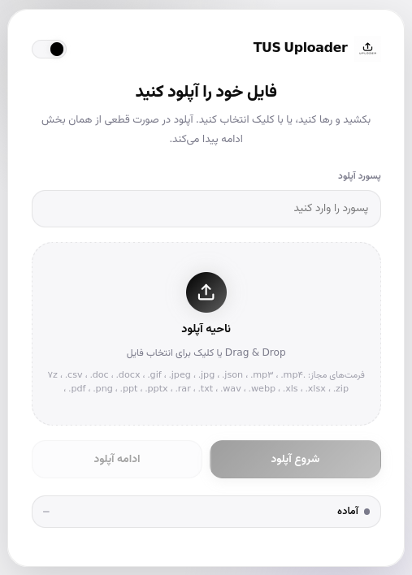

# TUS Uploader

A secure resumable uploader built with FastAPI, `tus`, `python-dotenv`, and a responsive Uppy-based frontend.



## Features

- Chunked upload flow with `POST`, `HEAD`, `PATCH`, and `OPTIONS` endpoints based on the tus 1.0 protocol
- No database; upload state is stored in `tmp/<UPLOAD_ID>.tus`
- Final files are stored in `uploads/` with `uuid`-based names
- The original filename is not used for storage
- Direct static file links served from `BASE_URL/uploads/...`
- Frontend with drag-and-drop upload, inline direct link display, progress, speed, ETA, retry/resume, and light/dark themes
- Optional upload password from `.env`

## Project Structure

```text
.
├── main.py
├── utils/
│   ├── config.py
│   ├── middlewares.py
│   ├── routes.py
│   ├── storage.py
│   └── validators.py
├── requirements.txt
├── .env.sample
├── static/
│   ├── app.css
│   ├── app.js
│   ├── favicon.ico
│   ├── index.html
│   └── logo.png
├── tmp/
└── uploads/
```

## Environment

Copy `.env.sample` into `.env` if needed. The repo already contains a local `.env` for development.

```env
DEBUG=YES
PORT=8989
BASE_URL=http://localhost:8989
CORS_ALLOWEDS=http://localhost:8989,http://127.0.0.1:8989
MAX_UPLOAD_SIZE=1073741824
CHUNK_SIZE=5242880
UPLOAD_PASSWORD=change-me
```

## Install

```bash
python -m venv .venv
source .venv/bin/activate
pip install -r requirements.txt
```

## Run

Because `main.py` loads `.env` and starts `uvicorn` with the configured port, run:

```bash
python main.py
```

Then open:

```text
http://localhost:8989
```

## Docker

Build and run the container on port 80:

```bash
docker build -t tus-uploader .
docker run -p 80:80 tus-uploader
```

For production deployments, `uploads` and `tmp` can be defined as Docker-managed volumes or mounted from a host disk path so uploaded files and resumable upload state survive container replacement. The Dockerfile does not define these mounts directly; configure them in your Docker run command, Compose file, or deployment platform.

## API

### Create upload

`POST /files`

Required headers:

- `Tus-Resumable: 1.0.0`
- `Upload-Length: <bytes>`
- `Upload-Metadata: filename <base64>,filetype <base64>`
- `X-Upload-Password: <password>` when `UPLOAD_PASSWORD` is set

### Check offset

`HEAD /files/{upload_id}`

### Send chunk

`PATCH /files/{upload_id}`

Required headers:

- `Tus-Resumable: 1.0.0`
- `Content-Type: application/offset+octet-stream`
- `Upload-Offset: <current_offset>`
- `X-Upload-Password: <password>` when `UPLOAD_PASSWORD` is set

### Get direct link

`GET /api/files/{upload_id}/link`

### Download file

`GET /uploads/{uuid-and-extension}`

## Security Notes

- Files are only accepted from an explicit extension and MIME allowlist
- Stored filenames are randomized UUIDs
- Upload creation and chunk transfer can be protected with `UPLOAD_PASSWORD`
- Final files are exposed directly from `/uploads/`
- `X-Content-Type-Options: nosniff` and other baseline headers are applied
- `.tus` state files are removed automatically after a successful upload
